# 🎵 Azure Data Factory — Spotify Incremental Ingestion Pipeline

This repository contains a complete **Azure Data Factory (ADF)** project that implements an automated, **metadata-driven incremental ingestion pipeline** for Spotify analytics data.

The pipeline extracts data from **Azure SQL Database**, loads **only new or updated records**, supports backfilling, and stores the output into **Azure Data Lake Storage Gen2 (ADLS)** in **Parquet** format.

> **Target Audience:** Analytics Engineers, BI Engineers, and Data Engineers looking for real-world data engineering patterns.

---

## 📁 Repository Structure

```text
azure-data-factory-spotify-project/
│
├── datasets/source_scripts
│   ├── loop_input.txt
│   ├── new_updated_date.json
│   ├── spotify_incremental_load.sql
│   ├── spotify_initial_load.sql
│   └── last_updated_date.json
│
├── assets/
│   ├── 01_ds_spotify_source_sqldb.png
│   ├── 02_ds_spotify_sink_bronze_adls.png
│   ├── … (16 total images)
│
└── README.md   ← You are here
````

-----

## 🚀 Project Overview

This project demonstrates how to build a **production-grade incremental data pipeline** using Azure Data Factory.

### ✅ Incremental Ingestion Logic

  * Reads source tables from **Azure SQL DB**.
  * Extracts only records where last-updated-date > previously-processed-date.
  * Writes the new/updated data to **ADLS (Bronze Layer)**.

### ✅ Backfilling Support

  * If historical data is corrected or changed, the pipeline can reprocess past records by simply adjusting the **JSON metadata file**.

### ✅ Dynamic Metadata-Driven Pipeline

  * A **single pipeline loops** through multiple tables dynamically.
  * Table details (`schema`, `table name`, `output folder`, `date column`) are passed as items into a **ForEach** loop.

### ✅ Automated File Tracking (JSON)

  * `last_updated_date.json` stores the **last ingestion timestamp**.
  * The pipeline updates this file automatically after every successful run.

### ✅ Safe Data Handling

  * If **no incremental data is found**:
      * The empty landing file is deleted.
      * Metadata is **NOT** updated, preventing data drift.

-----

## 🏗️ Solution Architecture

### 🔹 Source System

  * **Azure SQL Database**: Tables contain a `last_updated_date` column used for incremental detection.

### 🔹 Pipeline Components

  * Linked Services, Datasets, Lookup, Copy Activity, Script Activity, Set Variable, If Condition, Delete Activity.

### 🔹 Sink Storage

  * **Azure Data Lake Gen2**:
      * **Path Structure:** `/spotify/bronze/{table_name}/{file_processed_date}/`
      * **Format:** Parquet (Snappy Compression).

-----

## 📦 Key Pipeline Components

### 1️⃣ Source Dataset — Azure SQL Database

**📷 Screenshot:** 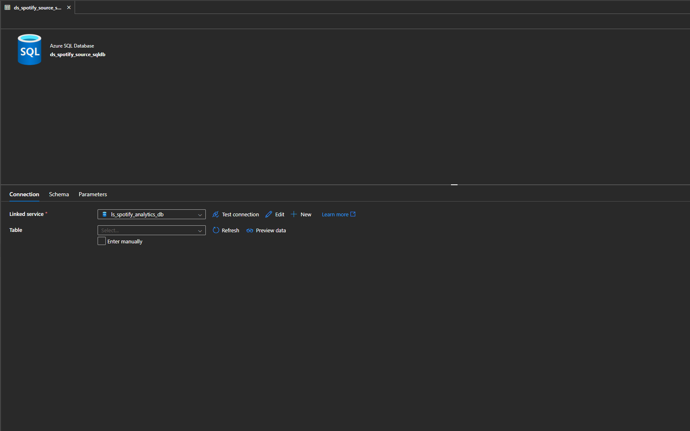

A dynamic SQL source dataset pointing to Azure SQL DB.

  * **Schema & Table:** Derived from ForEach items.
  * **Query Logic:**
    ```sql
    SELECT * FROM @{item().schema}.@{item().table}
    WHERE @{item().last_updated_date} > @{activity('File Last Updated Date').output.value[0].last_updated_date}
    ```

### 2️⃣ Bronze Sink — ADLS Parquet Dataset

**📷 Screenshot:** 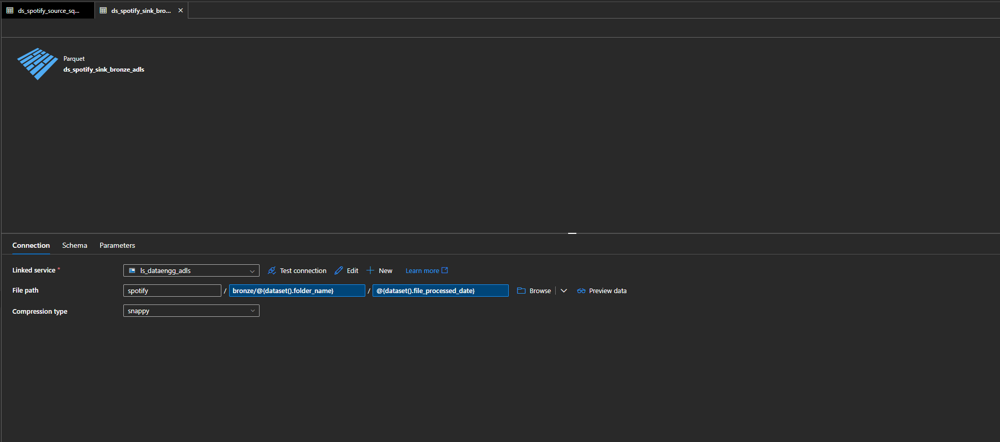

Dynamic file path construction:

```text
/spotify/bronze/@{dataset().folder_name}/@{dataset().file_processed_date}/
```

  * `folder_name` → derived from metadata.
  * `file_processed_date` → current timestamp via pipeline variable.

### 3️⃣ JSON Tracking Files

**📷 Screenshots:**

  * 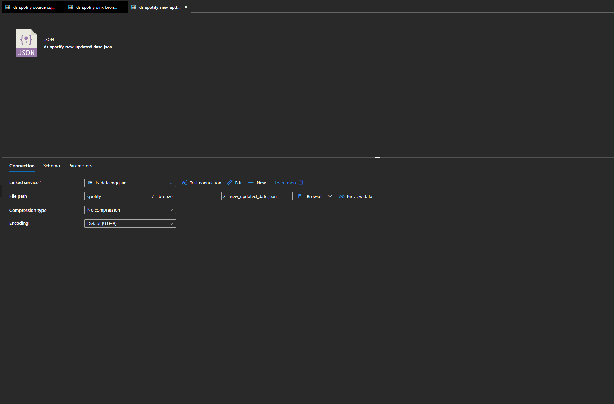

  * 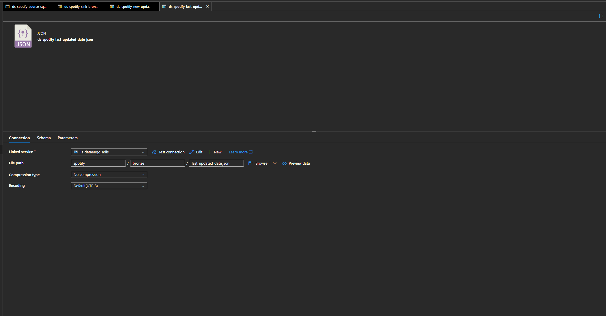

  * **`last_updated_date.json`**: Stores the last processed timestamp for each table.

  * **`new_updated_date.json`**: Temporary file used during metadata update operations.

### 4️⃣ ForEach Loop — Metadata Driven

**📷 Screenshots:**

  * 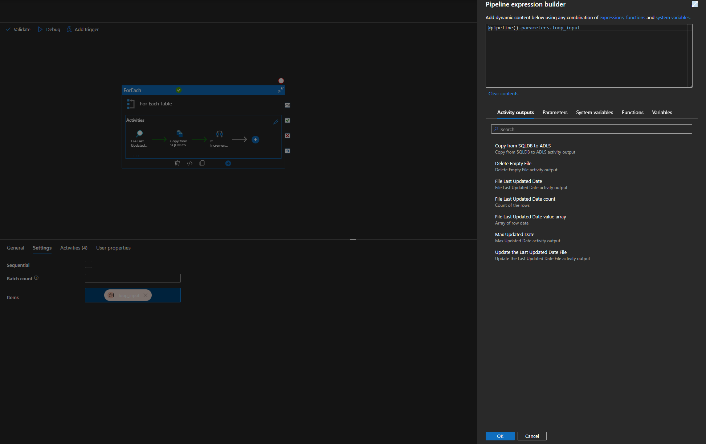
  * 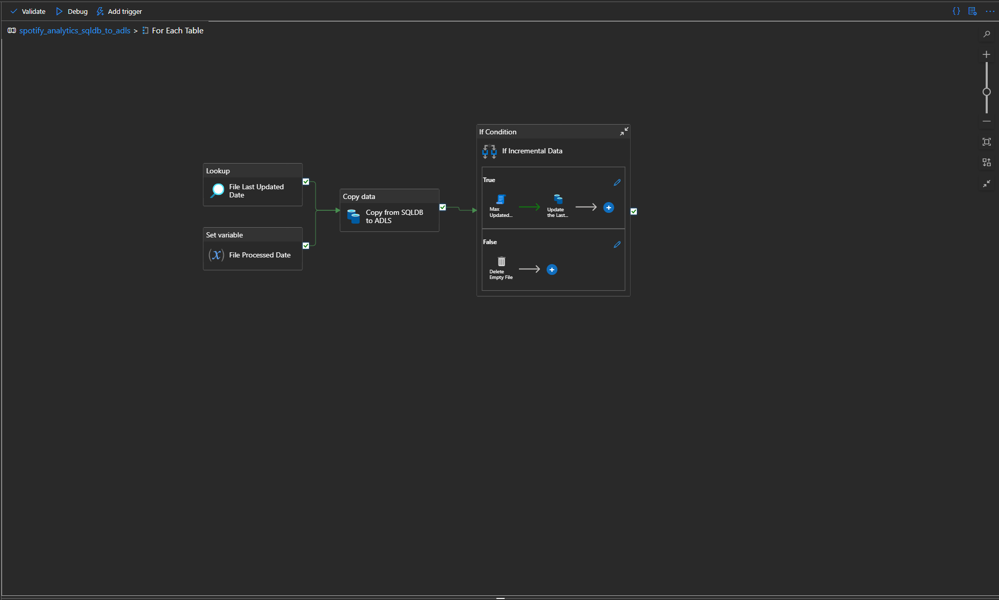

The pipeline iterates through a list of tables defined in the pipeline parameters:

```json
[
  {
    "schema": "dbo",
    "table": "spotify_tracks",
    "output_folder_name": "spotify_tracks",
    "last_updated_date": "updated_at"
  }
]
```

### 5️⃣ Lookup & Variable Setting

**📷 Screenshots:**

  * 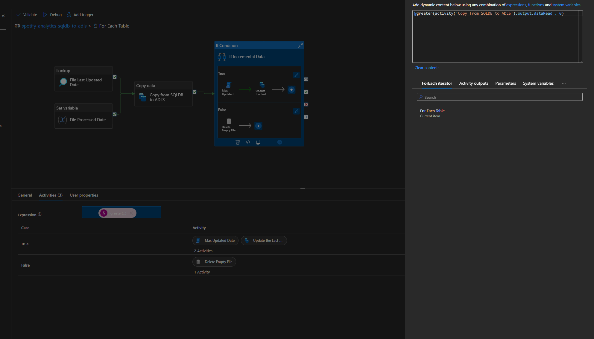

  * 

  * **Lookup:** Reads existing `last_updated_date.json` to determine the waterline.

  * **Set Variable:** Captures `@utcNow()` to use for the file processed date folder.

### 6️⃣ Copy Activity — SQL DB → ADLS Bronze

**📷 Screenshots:**

  * 

  * 

  * Source query is dynamically built using the Table Name, Schema, and Date logic.

  * Sink writes **Parquet** files using **Snappy** compression.

### 7️⃣ IF Condition — Check Incremental Data

**📷 Screenshot:** 

**Logic:** `@greater(activity('Copy from SQLDB to ADLS').output.dataRead, 0)`

| Result | Action | Screenshots |
| :--- | :--- | :--- |
| **TRUE** (New Data) | 1. Calculate Max Date (Script)<br>2. Update `last_updated_date.json` | <br>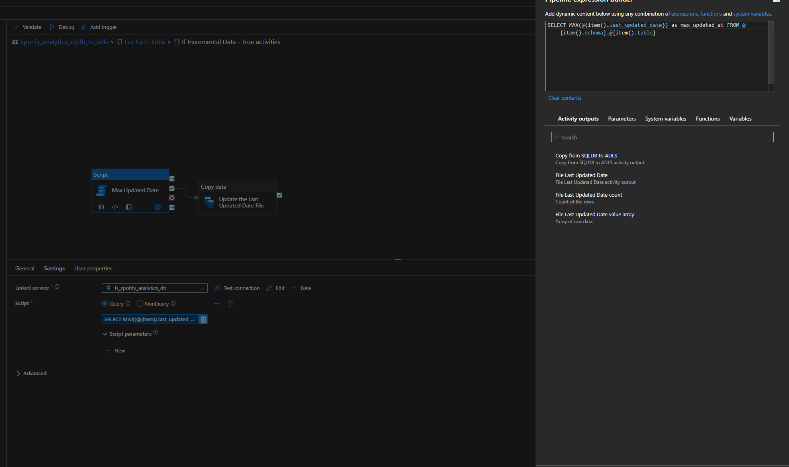<br>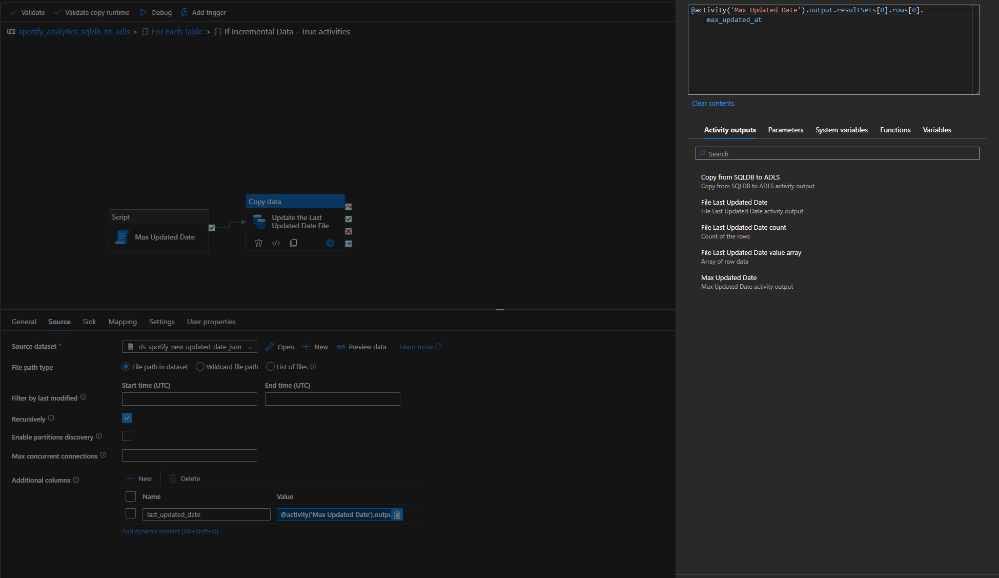<br>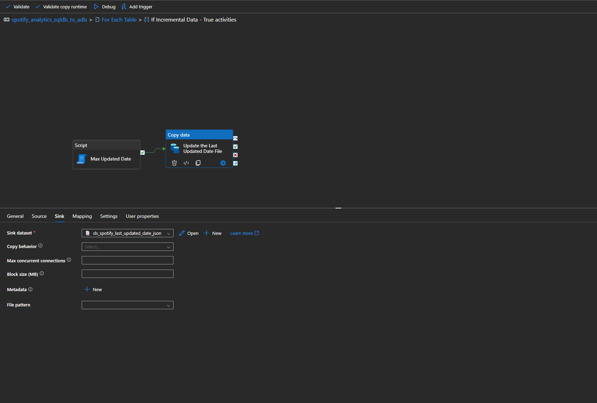 |
| **FALSE** (No Data) | 1. Delete empty file | <br>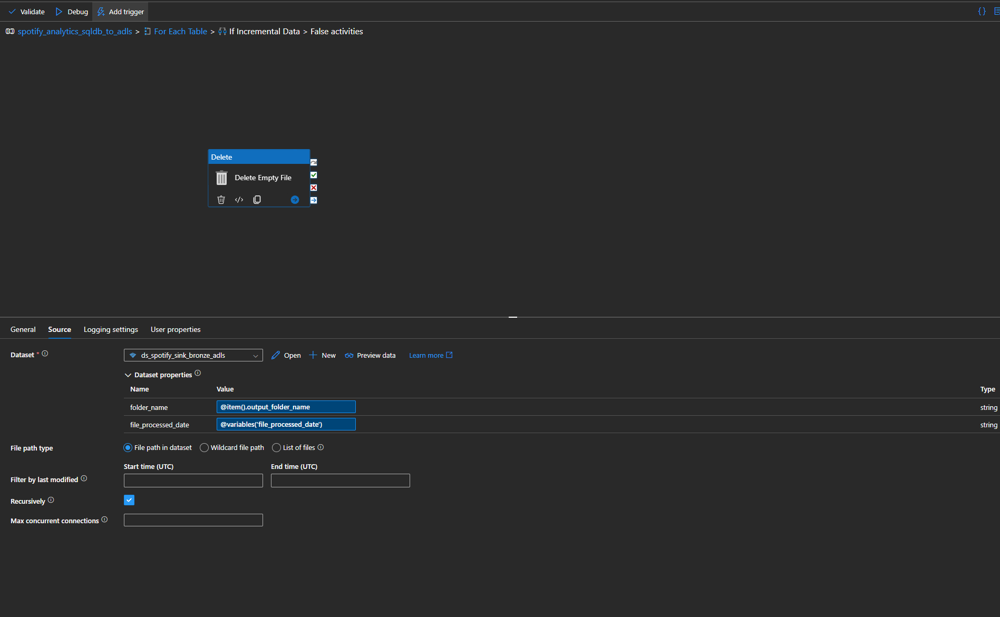 |

-----

## 🔁 Backfilling Support

To force historical reprocessing, manually edit the metadata JSON in ADLS:

```json
{
  "last_updated_date": "2020-01-01T00:00:00Z"
}
```

**Use Cases:** Data corrections, late-arriving changes, or full replay scenarios.

-----

## 📊 Final Output (Bronze Layer)

Files are generated in the following structure:

> `/spotify/bronze/{table_name}/{file_processed_date}/part-*.snappy.parquet`

**Benefits:**

  * **Dynamic folder structure** for easy partitioning.
  * **Efficient columnar storage** (Parquet).
  * **Ready for downstream** Silver/Gold transformation pipelines.
